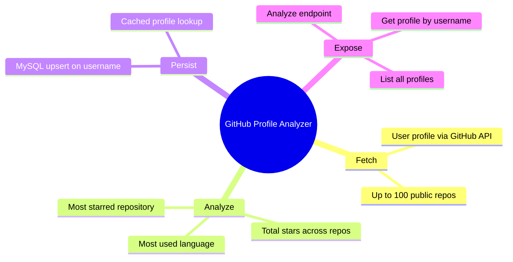
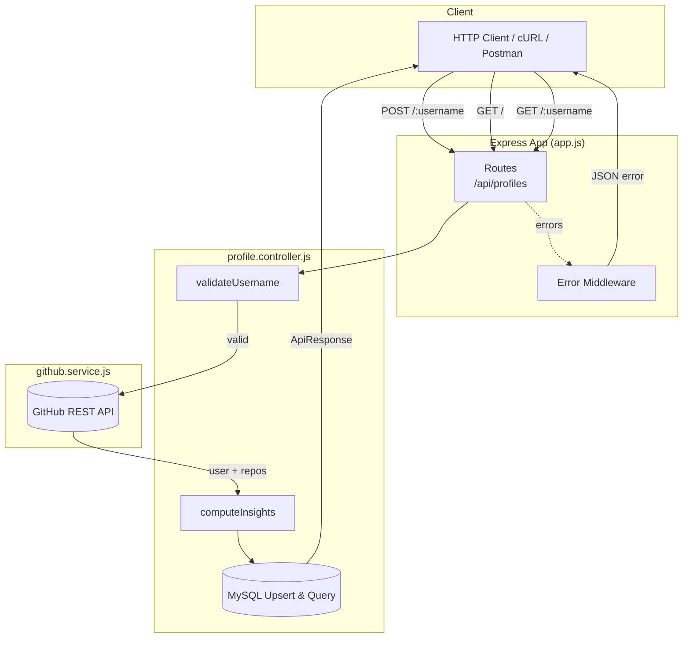
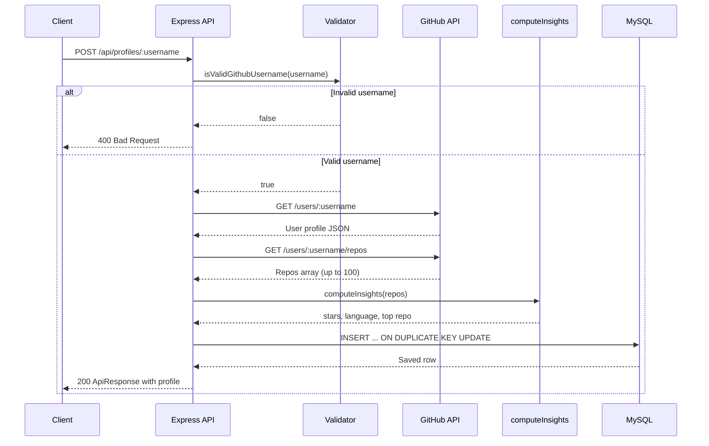
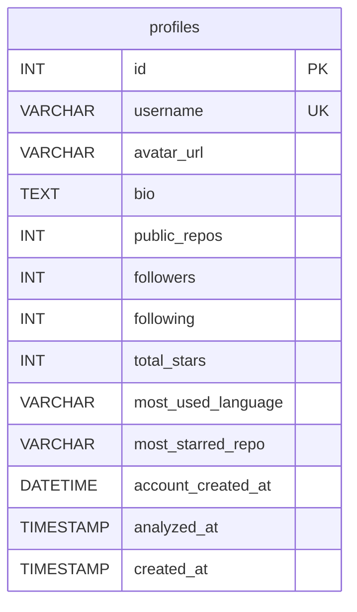
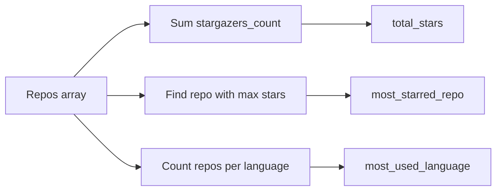

# GitHub Profile Analyzer

A REST API that fetches public GitHub profile data, computes developer insights from repositories, and persists the results in MySQL for later retrieval.



---

## Table of Contents

- [Overview](#overview)
- [Features](#features)
- [Tech Stack](#tech-stack)
- [Architecture](#architecture)
- [Project Structure](#project-structure)
- [Database Schema](#database-schema)
- [API Reference](#api-reference)
- [Getting Started](#getting-started)
- [Environment Variables](#environment-variables)
- [Usage Examples](#usage-examples)
- [How Insights Are Computed](#how-insights-are-computed)
- [Error Handling](#error-handling)

---

## Overview

**GitHub Profile Analyzer** is a Node.js backend service built with Express. Given a GitHub username, it:

1. Validates the username format
2. Calls the [GitHub REST API](https://docs.github.com/en/rest) to fetch user and repository data
3. Derives insights (stars, language usage, top repo)
4. Saves or updates the profile in a MySQL database
5. Returns the stored profile as a structured JSON response

Previously analyzed profiles can be retrieved from the database without re-calling GitHub.

---

## Live Deployment

- **API Base URL:** https://github-profile-analyzer-lw3b.onrender.com
- **Database:** MySQL hosted on Aiven (free tier)
- **Hosting:** Render (free tier — first request after inactivity may take 30-60s due to cold start)

Example:
```bash
curl -X POST https://github-profile-analyzer-lw3b.onrender.com/api/profiles/octocat
```
---

## Features

| Feature | Description |
|---------|-------------|
| **Profile analysis** | Fetches avatar, bio, repo count, followers, following, and account age |
| **Repo insights** | Aggregates total stars, most-used language, and most-starred repo |
| **Persistence** | Upserts profiles by username; re-analysis refreshes stored data |
| **Validation** | Rejects invalid GitHub username formats before hitting the API |
| **Consistent responses** | Standardized `ApiResponse` / `ApiError` envelope across endpoints |
| **Async safety** | `asyncHandler` wrapper forwards promise rejections to Express error middleware |

---

## Tech Stack

| Layer | Technology |
|-------|------------|
| Runtime | Node.js |
| Framework | Express 5 |
| HTTP client | Axios |
| Database | MySQL (via `mysql2` connection pool) |
| Config | dotenv |
| Dev server | Nodemon |

---

## Architecture



### Request flow — analyze profile



---

## Project Structure

```
github_analyzer/
├── schema.sql                  # Database & table DDL
├── package.json
├── .env                        # Environment config (not committed)
├── .gitignore
└── src/
    ├── server.js               # Entry point — starts HTTP server
    ├── app.js                  # Express app, routes, middleware
    ├── config/
    │   └── db.js               # MySQL connection pool
    ├── controllers/
    │   └── profile.controller.js
    ├── routes/
    │   └── profile.routes.js
    ├── services/
    │   └── github.service.js   # GitHub API integration
    └── utils/
        ├── ApiError.js         # Custom error class
        ├── ApiResponse.js      # Standard success response
        ├── asyncHandler.js     # Async route wrapper
        ├── computeInsights.js  # Repo analytics logic
        └── validateUsername.js # GitHub username regex
```

---

## Database Schema

The `profiles` table stores one row per GitHub username (unique constraint). Re-analysis updates existing rows via `ON DUPLICATE KEY UPDATE`.



| Column | Type | Description |
|--------|------|-------------|
| `id` | INT | Auto-increment primary key |
| `username` | VARCHAR(255) | GitHub login (unique) |
| `avatar_url` | VARCHAR(500) | Profile image URL |
| `bio` | TEXT | User bio |
| `public_repos` | INT | Public repository count |
| `followers` | INT | Follower count |
| `following` | INT | Following count |
| `total_stars` | INT | Sum of `stargazers_count` across fetched repos |
| `most_used_language` | VARCHAR(100) | Language appearing in the most repos |
| `most_starred_repo` | VARCHAR(255) | Repo name with highest star count |
| `account_created_at` | DATETIME | GitHub account creation date |
| `analyzed_at` | TIMESTAMP | Last analysis timestamp (auto-updated) |
| `created_at` | TIMESTAMP | First insert timestamp |

Initialize the database:

```bash
mysql -u <user> -p < schema.sql
```

---

## API Reference

**Base URL:** `http://localhost:5000`

### Health check

```
GET /
```

**Response (200)**

```json
{
  "success": true,
  "message": "Github Profile Analyzer API is running."
}
```

---

### Analyze & save profile

Fetches live data from GitHub, computes insights, and upserts into the database.

```
POST /api/profiles/:username
```

| Param | Location | Description |
|-------|----------|-------------|
| `username` | path | GitHub username (alphanumeric, hyphens; max 39 chars) |

**Response (200)**

```json
{
  "statusCode": 200,
  "data": {
    "id": 1,
    "username": "octocat",
    "avatar_url": "https://avatars.githubusercontent.com/u/583231?",
    "bio": "GitHub's mascot",
    "public_repos": 8,
    "followers": 10000,
    "following": 9,
    "total_stars": 1500,
    "most_used_language": "JavaScript",
    "most_starred_repo": "Hello-World",
    "account_created_at": "2011-01-25T18:44:36.000Z",
    "analyzed_at": "2026-06-11T10:00:00.000Z",
    "created_at": "2026-06-11T09:00:00.000Z"
  },
  "message": "Profile analyzed and saved successfully",
  "success": true
}
```

---

### List all stored profiles

```
GET /api/profiles
```

Returns all profiles ordered by `analyzed_at` descending.

**Response (200)**

```json
{
  "statusCode": 200,
  "data": [ /* array of profile objects */ ],
  "message": "Profiles fetched successfully",
  "success": true
}
```

---

### Get profile by username

Reads from the database only (no GitHub API call).

```
GET /api/profiles/:username
```

**Response (200)** — single profile object in `data`

**Response (404)** — profile not found in database

---

## Getting Started

### Prerequisites

- [Node.js](https://nodejs.org/) (v18+ recommended)
- [MySQL](https://www.mysql.com/) 8.x (local or cloud-hosted)
- Internet access for GitHub API calls

### Installation

```bash
# Clone the repository
git clone <repository-url>
cd github_analyzer

# Install dependencies
npm install

# Create a .env file in the project root (see Environment Variables below)

# Initialize the database
mysql -u <user> -p < schema.sql

# Start development server (with hot reload)
npm run dev

# Or start production server
npm start
```

The server listens on `PORT` (default: **5000**).

---

## Environment Variables

Create a `.env` file in the project root:

```env
PORT=5000
DB_HOST=localhost
DB_USER=your_db_user
DB_PASSWORD=your_db_password
DB_NAME=github_analyzer
DB_PORT=3306
DB_SSL=false
GITHUB_TOKEN=your_github_personal_access_token
```

| Variable | Required | Description |
|----------|----------|-------------|
| `PORT` | No | HTTP port (default: `5000`) |
| `DB_HOST` | Yes | MySQL host |
| `DB_USER` | Yes | MySQL username |
| `DB_PASSWORD` | Yes | MySQL password |
| `DB_NAME` | Yes | MySQL database name |
| `DB_PORT` | No | MySQL port (default: `3306`; cloud providers like Aiven use custom ports) |
| `DB_SSL` | No | Set to `true` for cloud-hosted MySQL requiring SSL (e.g., Aiven) |
| `GITHUB_TOKEN` | Yes | GitHub personal access token (no scopes needed for public data) — required to avoid the 60 req/hour unauthenticated rate limit |

> **Note:** All requests to the GitHub API are authenticated using `GITHUB_TOKEN`, raising the rate limit from 60 to 5,000 requests/hour.
---

## Usage Examples

### Analyze a GitHub user

```bash
curl -X POST http://localhost:5000/api/profiles/octocat
```

### List all analyzed profiles

```bash
curl http://localhost:5000/api/profiles
```

### Get a cached profile

```bash
curl http://localhost:5000/api/profiles/octocat
```

---

## How Insights Are Computed

`computeInsights` processes up to **100** public repositories returned by GitHub:



| Insight | Logic |
|---------|-------|
| `total_stars` | Sum of `stargazers_count` across all fetched repos |
| `most_starred_repo` | Name of the repo with the highest `stargazers_count` |
| `most_used_language` | Language that appears in the most repositories (repos with `null` language are skipped) |

If a user has no public repos, all insight fields default to `0` or `null`.

---

## Error Handling

The app uses a centralized error middleware in `app.js`:

| Status | Scenario |
|--------|----------|
| `400` | Invalid GitHub username format |
| `404` | GitHub user not found, route not found, or profile not in DB |
| `500` | GitHub API failure, database error, or unexpected exception |

**Error response shape:**

```json
{
  "success": false,
  "message": "Error description",
  "data": null
}
```

**Username validation rules** (GitHub-compatible):

- 1–39 characters
- Alphanumeric; hyphens allowed (not at start/end, no consecutive hyphens)
- Regex: `/^[a-zA-Z\d](?:[a-zA-Z\d]|-(?=[a-zA-Z\d])){0,38}$/`

---

## Scripts

| Command | Description |
|---------|-------------|
| `npm run dev` | Start server with Nodemon (auto-restart on file changes) |
| `npm start` | Start server with Node |
| `npm test` | Placeholder (no tests configured yet) |

---

## License

ISC
